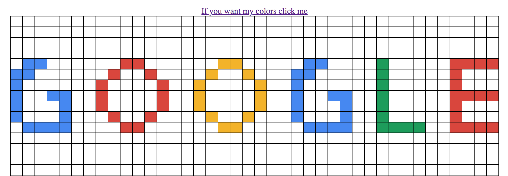

# Pixel Art Maker Project
Simple pixel art challenge! This project is done using JavaScrip with HTML/CSS.

## Instructions

To get started, open the `index.html`

and try to draw with your mouse!

Make sure that you download the _whole file_.

`P.S. still under development for harder stages!`
